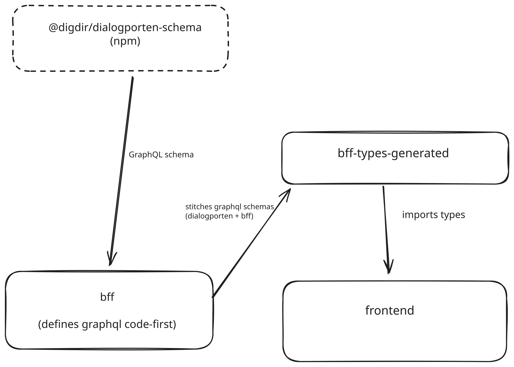

The application uses GraphQL for communication.
The build pipeline goes as follow:

1. The `Dialogporten` project publishes the npm package [@digdir/dialogporten-schma](https://www.npmjs.com/package/@digdir/dialogporten-schema) any time the schema changes. The package includes the raw graphql schema converted into a JavaScript file that exports it as a string and export the from the package.

1. We add the @digdir/dialogporten-schema npm package as a dependency to our project `bff`.

1. In the `bff` application we define our own GraphQL schema code-first, then we [stitch it](https://the-guild.dev/graphql/stitching) together with the schema we get from `Dialogporten`

1. In `bff-types-generated` we import the stitched schema from `bff`

    - Then we define GraphQL queries and fragment queries that the frontend need in `./packages/bff-types-generated/queries`

    - And then generate TypeScript types from the GraphQL schema as well as functions from the GraphQL queries

    - This produces two files: `generated/schema-types.ts`, holding a type for every type in the stitched schema, and `generated/sdk.ts`, holding a type per query/fragment plus the `getSdk()` client. Both are re-exported from the package, so importers see a single flat surface

    - The two files must stay separate. From v6, `typescript-operations` emits its own copy of every enum and input object its queries touch, and only skips this when `importSchemaTypesFrom` points it at another file. Merging them back into one output makes each of those types be declared twice

1. In the `frontend` we import the `bff-types-generated` package and have ready types and functions that we can use in the frontend

## Development

### When `dialogporten` releases new schema versions

1. Update the package version in `@digdir/dialogporten-schema` based on [the newest version](https://www.npmjs.com/package/@digdir/dialogporten-schema?activeTab=versions) in `bff`

1. Check for schema changes using [npmdiff.dev](https://npmdiff.dev/) and see if there is any breaking changes

1. Rebuild the project to ensure that there are no new build problems

### Caveats

`bff-types-generated` watches its own `queries` folder, so new or edited GraphQL queries rebuild automatically.

It does **not** watch the `bff` schema — `schema.ts` lives at the package root, outside the watched `src/**`. If you change the schema definitions in `bff`, the `bff` itself hot-reloads but the generated types do not; rebuild `bff-types-generated` manually.

