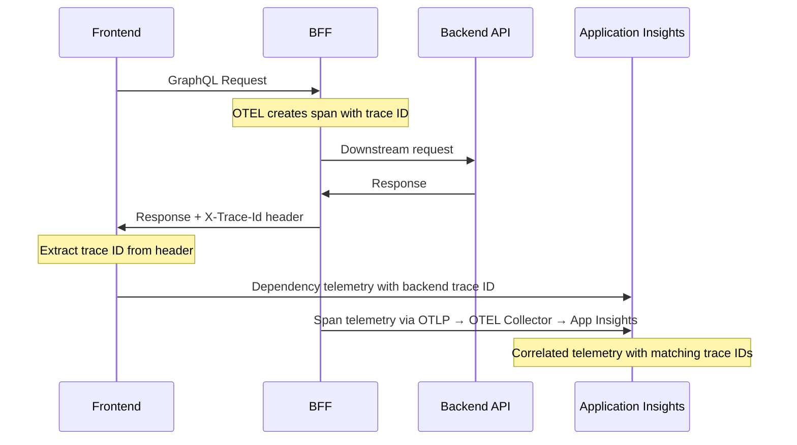

This document describes the observability setup for the Dialogporten Frontend application, covering both the Backend-for-Frontend (BFF) and Frontend instrumentation.

## Overview

The application uses a hybrid approach to observability:
- **BFF**: OpenTelemetry (OTEL) with OTLP exporter to Azure Container Apps OTEL Collector
- **Frontend**: Application Insights SDK directly

Both components are configured to work together, providing end-to-end tracing correlation through trace IDs.

## Backend-for-Frontend (BFF) Instrumentation

### Technology Stack
- **OpenTelemetry SDK**: Core instrumentation framework
- **OTLP Exporter**: Sends telemetry data to Azure Container Apps OTEL Collector
- **Pino OpenTelemetry Transport**: Automatic log instrumentation
- **Custom Instrumentations**: Additional OTEL instrumentations for specific libraries

### Configuration

The BFF uses OpenTelemetry with the OTLP exporter configured in `packages/bff/src/instrumentation.ts`:

```typescript
import { NodeSDK } from '@opentelemetry/sdk-node';
import { OTLPTraceExporter } from '@opentelemetry/exporter-trace-otlp-grpc';
import { OTLPMetricExporter } from '@opentelemetry/exporter-metrics-otlp-grpc';
```

#### Key Features:
1. **OTLP Integration**: Exports to Azure Container Apps OTEL Collector which forwards to Application Insights
2. **Resource Attribution**: Custom service name and instance ID
3. **Multi-Library Support**: HTTP, GraphQL, Redis, PostgreSQL, and Fastify instrumentation
4. **Trace ID Propagation**: Adds `X-Trace-Id` header to all responses
5. **Automatic Log Instrumentation**: All logs and exceptions are sent through OpenTelemetry

#### Enabled Instrumentations:
- **HTTP Instrumentation**: Tracks incoming/outgoing HTTP requests
- **GraphQL Instrumentation**: Monitors GraphQL operations with span merging
- **IORedis Instrumentation**: Tracks Redis operations
- **Fastify OTEL Instrumentation**: Framework-specific instrumentation
- **PostgreSQL Instrumentation**: Database query tracking

#### Filtering and Optimization:
- **Health Check Filtering**: Excludes `/api/liveness` and `/api/readiness` endpoints
- **OPTIONS Request Filtering**: Ignores CORS preflight requests
- **GraphQL Optimization**: Ignores trivial resolver spans and merges related spans

### Logging Integration

The BFF uses Pino logger with OpenTelemetry transport for automatic log instrumentation:

#### Production Mode (with OTEL endpoint):
- All logs (trace, debug, info, warn, error, fatal) are sent through OpenTelemetry
- Logs are automatically correlated with traces using trace context
- No console output - all logs go through OTLP exporter

#### Local Development Mode (without OTEL endpoint):
- Logs are output to console with pretty formatting or json formatting
- No telemetry is sent to remote collectors

The logger automatically detects the presence of `OTEL_EXPORTER_OTLP_ENDPOINT` environment variable to determine which mode to use.

### Trace ID Propagation

The BFF automatically adds trace IDs to response headers:

```typescript
// In fastifyHeaders.ts
const currentSpan = trace.getActiveSpan();
if (currentSpan?.spanContext().traceId) {
  const traceId = currentSpan.spanContext().traceId;
  reply.header('X-Trace-Id', traceId);
}
```

This enables correlation with frontend telemetry.

## Frontend Instrumentation

### Technology Stack
- **Application Insights Web SDK**: Direct integration with Azure Application Insights
- **React Plugin**: React-specific instrumentation
- **Manual Dependency Tracking**: Custom fetch/XHR tracking

### Configuration

The frontend uses Application Insights SDK directly, configured in `packages/frontend/src/analytics/analytics.ts`:

```typescript
import { ApplicationInsights } from '@microsoft/applicationinsights-web';
import { ReactPlugin } from '@microsoft/applicationinsights-react-js';
```

#### Key Features:
1. **React Integration**: Automatic component lifecycle tracking
2. **Route Tracking**: Manual page view tracking via the `usePageTracking` hook (`enableAutoRouteTracking: false`), limited to an allowlist of routes
3. **Error Handling**: Manual `trackException` calls with noise filtering (`enableUnhandledPromiseRejectionTracking: false`)
4. **CORS Correlation**: Cross-origin request correlation
5. **Manual Dependency Tracking**: Custom fetch tracking with backend correlation

#### Configuration Highlights:
- **Disabled Automatic Tracking**: `disableAjaxTracking: true, disableFetchTracking: true`
- **Enhanced Correlation**: `enableCorsCorrelation: true`
- **Debug Mode**: Not enabled. Do not set `enableDebug` — it makes `_throwInternal` throw before `clearSent`, which wedges failed telemetry in sessionStorage until it trips the 48h limit
- **Sampling**: `samplingPercentage: 100` — no client-side sampling

### Trace Correlation

The frontend correlates with backend traces through the `trackFetchDependency` function:

```typescript
const trackFetchDependency = async (
  name: string,
  fetchPromise: Promise<Response>,
  startTime: number = Date.now(),
): Promise<Response> => {
  // ... await the promise, record status and duration ...

  // Extract backend trace ID from response
  backendTraceId = response.headers.get('X-Trace-Id') || backendTraceId;

  // Track dependency with correlation
  Analytics.trackDependency({
    id: backendTraceId,
    target: targetUrl,
    name,
    duration,
    success,
    responseCode: responseStatus,
    properties: {
      'backend.traceId': backendTraceId,
      'correlation.source': 'backend-response',
      'request.type': name.includes('GraphQL') ? 'graphql' : 'http',
    },
    type: 'HTTP',
  });
};
```

**Note**: dependency telemetry is currently discarded before it leaves the browser. All
deployed environments set `applicationInsightsDisableDependencyTracking` to `'true'`, and the
telemetry initializer drops every `RemoteDependencyData` envelope when that flag is on. The
correlation described above works, but the resulting telemetry does not reach Application
Insights until that parameter is flipped in `.azure/applications/frontend/*.bicepparam`.

### Error Filtering

The frontend implements intelligent error filtering to reduce noise:

- **Browser Extension Errors**: Filters out errors from browser extensions
- **Cross-Origin Errors**: Excludes generic "Script error" messages
- **Stack Trace Analysis**: Examines parsed stack traces for extension URLs

## End-to-End Correlation Flow



## Environment Configuration

### BFF Environment Variables
```bash
# OpenTelemetry OTLP endpoint (automatically set by Azure Container Apps)
OTEL_EXPORTER_OTLP_ENDPOINT="http://localhost:4317"

# Trace sampling ratio, 0-1 (optional, defaults to 1 = sample everything)
OTEL_TRACES_SAMPLER_ARG="1"

# OpenTelemetry protocol (parsed but NOT honoured - see note below)
OTEL_EXPORTER_OTLP_PROTOCOL="grpc"  # Options: http/protobuf, http/json, grpc
```

**Note**: `OTEL_EXPORTER_OTLP_PROTOCOL` is validated and logged at startup, but the exporters
in `instrumentation.ts` are hardcoded to the gRPC variants, so changing it has no effect.

**Note**: When `OTEL_EXPORTER_OTLP_ENDPOINT` is not set, the BFF runs in local development mode with console output for logs and traces.

### Frontend Configuration
The frontend receives its instrumentation key through a global variable. For details on how to add new environment variables, see the [Environment Variables](./environment+variables.md) documentation.

## Monitoring and Debugging

### Key Metrics to Monitor
1. **Request Duration**: End-to-end request timing
2. **Error Rates**: Application and dependency errors
3. **Dependency Failures**: Backend API failures
4. **GraphQL Operations**: Query/mutation performance
5. **Database Performance**: PostgreSQL query timing
6. **Redis Performance**: Cache operation timing

### Debugging Tips
1. **Trace ID Correlation**: Use `X-Trace-Id` header to correlate frontend and backend logs
2. **Debug Mode**: Enable debug mode in development for detailed telemetry logs
3. **Sampling**: Adjust sampling percentage for development vs. production
