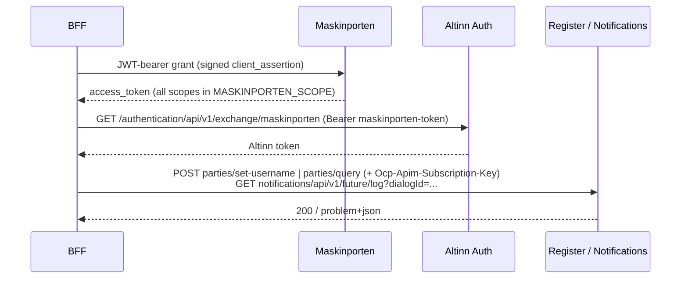

Machine-to-machine flow used by the BFF for endpoints that require a scope no end-user token
carries: the Altinn Register `set-username` / party-query endpoints, and the Altinn Notifications
log endpoint behind the `notificationLogs` query.

> Status: token exchange is being verified end-to-end. Treat the exchange step as provisional.

## Flow

Both tokens are cached in Redis, each keyed off its own expiry. One token covers every scope in
`MASKINPORTEN_SCOPE`, so adding a scope does not add a second token round-trip.

## Config (BFF)

| Variable | Purpose |
| --- | --- |
| `MASKINPORTEN_CLIENT_ID` | Maskinporten integration client id |
| `MASKINPORTEN_JWK` | Private JWK (JSON) signing the `client_assertion`; store as secret |
| `MASKINPORTEN_ISSUER` | Issuer base URL; token endpoint is `<issuer>token` |
| `MASKINPORTEN_SCOPE` | Space-separated scopes: `altinn:register/partylookup.admin` (register) and `altinn:serviceowner/notifications.create` (notification logs) |
| `REGISTER_SUBSCRIPTION_KEY` | APIM key for register endpoints (`Ocp-Apim-Subscription-Key`) |

The `set-username` UI is gated by the `profile.enableSetUserName` feature flag.
