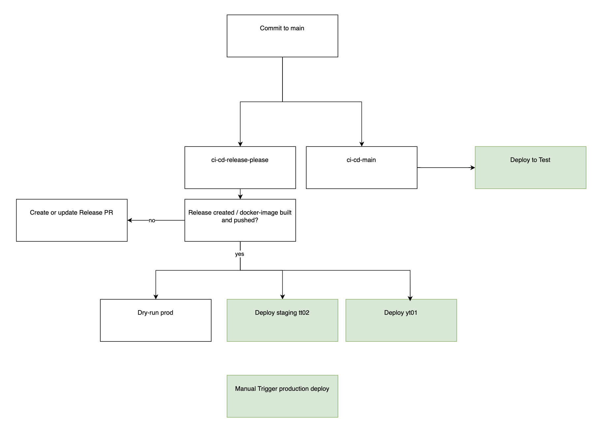

# Dialogporten CI/CD Documentation

Naming conventions for GitHub Actions:
- `workflow-*.yml`: Reusable workflows
- `ci-cd-*.yml`: Workflows that are triggered by an event
- `dispatch-*.yml`: Workflows that are dispatchable

## Dialogporten CI/CD Flow

### 1. Development & Merge Process

1. **Development**
   - Create feature branch from `main`
   - Follow branch naming convention: `(feat|fix|docs|test|ci|chore|trivial)!?(\\(.*\\))?!?:.*`
   - Create PR against `main`
   - PR title must follow conventional commits format (validated by `ci-cd-pull-request-title.yml`)
   - Get code review and approval
   - Merge to `main`

2. **Main Branch Triggers**  
When code is merged to `main`, two workflows always run in parallel, plus a
third that only starts when the schema package is touched:

   a. **CI/CD Main** (`ci-cd-main.yml`)
   - Automatically deploys to Test environment
   - Runs full deployment including:
     - Infrastructure if changed
     - Applications if changed
     - Runs tests

   b. **Release Please** (`ci-cd-release-please.yml`)
   - Checks if changes warrant a new release
   - Either:
     - Creates/updates release PR, or
     - Builds and publishes Docker images if release is complete

   c. **Publish Schema NPM** (`ci-cd-publish-schema.yml`) — path-filtered
   - Only starts when the push touches `docs/schema/V*/**`,
     `.github/actions/build-schema/**`, or the workflow file itself
   - Publishes `@digdir/dialogporten-schema@${version.txt}-${shortSha}` if the
     schema package changed, under the `prerelease` dist-tag, so a bare
     `npm install` still resolves to a real release
   - Runs independently of `ci-cd-main.yml`, so it is **not** gated on a
     successful deployment to Test

### 2. Release & Deployment Flow

#### When Release is Created/Published:
`ci-cd-release-please.yml` emits a `release_created` repository dispatch, which
four parallel workflows consume:

1. **Production Dry Run** (`ci-cd-prod-dry-run.yml`)
   - Validates production deployment configuration
   - No actual deployment
   - Early warning for potential production issues

2. **Staging Deployment** (`ci-cd-staging.yml`)
   - Deploys to staging (tt02) environment
   - Full deployment including:
     - Infrastructure updates
     - Application deployment
     - Database migrations
     - SDK (NuGet) publishing
     - End-to-end testing

3. **YT01 Deployment** (`ci-cd-yt01.yml`)
   - Deploys to YT01 environment
   - Performance testing environment
   - Deployment similar to staging, but does not publish the SDK

4. **Publish Schema NPM** (`ci-cd-publish-schema.yml`)
   - Publishes `@digdir/dialogporten-schema` at the release version, under the
     `latest` dist-tag
   - Runs in parallel with the staging deployment, not after it

> **Note:** `ci-cd-publish-schema.yml` is the sole publisher of the npm schema
> package and authenticates via npm Trusted Publishing over OIDC, so no npm token
> is involved.
>
> Keep the publish step inline in this file. npm binds the Trusted Publisher
> record to the exact workflow **filename**, and when `npm publish` runs inside a
> called workflow npm validates the *calling* workflow's name instead, so moving
> the step into a reusable `workflow-*.yml` or renaming this file would break
> publishing.

#### Production Deployment
- **Manual Trigger Required** (`ci-cd-prod.yml`)
- Requires specific version input
- Full deployment process:
  - Version verification
  - Infrastructure deployment
  - Application deployment
  - SDK publishing
  - Version tracking updates

##### Production Deployment Checklist
- Notify the team for possible objections/comments (ping `@dialogporten-backend` in Slack and/or mention it at daily standup).
- Verify the release has been deployed to tt02 and yt01 without issues.

### 3. Environment Flow
```
Development → Main Branch → Test → [YT01 + Staging] → Production
                           ↑         ↑                  ↑
                    Auto deploy    Auto deploy    Manual deploy
                    on merge       on release      with version
```

### 4. Environment Purposes

- **Test**: Automatic deployment target for all changes merged to main
- **YT01**: Performance test environment, automatically updated with releases
- **Staging (tt02)**: Pre-production verification, automatically updated with releases
- **Production**: Production environment, requires manual deployment trigger

### 5. Manual Control Options

Available manual workflows for all environments:
- `dispatch-infrastructure.yml`: Infrastructure deployment
- `dispatch-apps.yml`: Application deployment
- `dispatch-k6-tests.yml`: Functional testing
- `dispatch-k6-performance.yml`: Performance testing
- `dispatch-k6-breakpoint.yml`: Breakpoint testing
- `dispatch-deployment-lag-check.yml`: Deployment lag monitoring
- `dispatch-deploy-branch-yt01.yml`: Deploy an arbitrary branch to YT01 (see [Out-of-band deploys](#out-of-band-deploys))
- `dispatch-build-hotfix-prod.yml`: Build + release an emergency production hotfix image (see [Out-of-band deploys](#out-of-band-deploys))

### 6. Automated Monitoring

- `ci-cd-deployment-lag-monitor.yml`: Monitors deployment lag between staging and production environments. Runs weekdays at 12pm Norway time and sends Slack notifications when production is lagging behind staging. See [DeploymentLagMonitoring.md](DeploymentLagMonitoring.md) for detailed documentation.

#### Using `dispatch-apps.yml`

The `dispatch-apps.yml` workflow is responsible for deploying applications. To trigger this workflow:

1. Navigate to the Actions tab in the GitHub repository.
2. Select the `Dispatch Apps` workflow.
3. Click on "Run workflow".
4. Fill in the required inputs:
   - **environment**: Choose the target environment (`test`, `yt01`, `staging`, or `prod`).
   - **version**: Specify the version to deploy. Could be git tag or a docker-tag published in packages.
   - **runMigration** (optional): Indicate whether to run database migrations (`true` or `false`).

This workflow will handle the deployment of applications based on the specified parameters, ensuring that the correct version is deployed to the chosen environment.

#### Using `dispatch-infrastructure.yml`

The `dispatch-infrastructure.yml` workflow is used for deploying infrastructure components. To use this workflow:

1. Go to the Actions tab in the GitHub repository.
2. Select the `Dispatch Infrastructure` workflow.
3. Click on "Run workflow".
4. Provide the necessary inputs:
   - **environment**: Select the environment you wish to deploy to (`test`, `yt01`, `staging`, or `prod`).
   - **version**: Enter the version to deploy, which should correspond to a git tag. (e.g., `1.23.4`).

This workflow facilitates the deployment of infrastructure to the specified environment, using the version details provided.


### 7. Version Management

- Release-please manages versioning based on conventional commits
- Versions are tracked in GitHub environment variables
- Separate tracking for infrastructure and applications
- Docker images tagged with release versions
- SDK and schema packages versioned with releases

[Release Please](https://github.com/googleapis/release-please-action) is used to create releases, generate changelog and bumping version numbers.

`CHANGELOG.md` and `version.txt` are automatically updated and should not be changed manually.

### 8. Visual Workflow



## Out-of-band deploys

The normal flow promotes a release tag through `main → test → [yt01 + staging] → prod`. Two dispatch
workflows support deploying *outside* that chain. Both are run **from `main`** and take an explicit
`ref` input that is what actually gets built and deployed. The YT01 deploy accepts an existing
branch or tag; the hotfix build accepts only an existing `hotfix/<name>` branch. Raw SHAs are not
accepted. GitHub only lists a
workflow in the "Run workflow" picker if the file exists on the chosen branch, so a hotfix branch cut
from an older tag would not show a newly added workflow. Running from `main` and passing the target as
`ref` avoids that.

### Experimental branch in YT01 (`dispatch-deploy-branch-yt01.yml`)

Deploy an unmerged branch to YT01 for early performance testing. This is **ephemeral**: it builds and
pushes images from the ref and updates the YT01 container apps, but does **not** update the
`dialogporten-manifests` GitOps repo, so the next normal YT01 deploy overwrites it.

Scope is intentionally just *build + deploy apps*. Migrations, infrastructure and performance tests are
handled by their own dispatch workflows (`dispatch-apps.yml`, `dispatch-infrastructure.yml`,
`dispatch-k6-performance.yml`) and can be run separately against YT01.

1. YT01 is scale-to-zero. Bring the environment up first via the `Scale yt01 (manual)` workflow
   (`dispatch-scale-yt01-manual.yml`, action `on`).
2. Run **Dispatch Deploy Branch to YT01** from `main` with **ref** = the branch/tag to deploy.

Images are tagged `<version>-<shortsha>` (from `version.txt` + the ref's short sha), same as the main
build convention.

### Emergency production hotfix (`dispatch-build-hotfix-prod.yml`)

A governed fast path to prod that skips test/staging but keeps the prod approval gate, produces a real
tag/release (rollback point + audit trail), and updates the prod manifests — by reusing the existing
**CI/CD Production** workflow for the actual deploy. The hotfix workflow itself only builds, tags and
releases.

1. **Branch from the currently deployed prod release tag** and commit the fix:
   ```bash
   git switch -c hotfix/<desc> v<currentProdVersion>
   # ...make the fix...
   git commit -am "fix: <desc>"
   git push -u origin hotfix/<desc>
   ```
   Branching from the prod tag (not `main`) keeps unreleased work off the hotfix.
2. Run **Build Production Hotfix Release** from `main` with **ref** = `hotfix/<desc>`. It builds and
   pushes images, creates tag `v<base>-hotfix<shortsha>` and a GitHub **prerelease**, and prints the
   resulting hotfix version in the run summary.
3. Run the **CI/CD Production** workflow with `version = <base>-hotfix<shortsha>` (the value from the
   summary). The prod approval gate fires; on approval it deploys infra/apps from the hotfix tag,
   updates the prod manifests, tags issues and reports to Swarmia/Slack.
4. **Back-merge (mandatory):** open a PR to merge `hotfix/<desc>` into `main` so the fix is not lost on
   the next release.

**Rollback:** redeploy the previous prod version by running **CI/CD Production** with the prior
`version = <x.y.z>` (same input format as step 3, without a leading `v`).

## Version Tracking and Change Detection

### 1. Version Storage Purpose
- GitHub environment variables store the latest deployed versions for each environment
- Separate tracking for:
  - Infrastructure version (`LATEST_DEPLOYED_INFRA_VERSION`)
  - Applications version (`LATEST_DEPLOYED_APPS_VERSION`)
- This enables accurate detection of what needs to be deployed in each environment

### 2. Change Detection Process (`workflow-check-for-changes.yml`)

1. **Version Comparison**
   - Retrieves latest deployed versions from GitHub environment variables
   - Compares current deployment version with last deployed version
   - Uses git commit SHAs to determine exact changes between versions

2. **Change Categories Tracked**
   ```yaml
   Changes detected in:
   - Infrastructure (Azure resources, GitHub workflows)
   - Backend code
   - Web API client
   - Test files
   - Swagger schema
   - GraphQL schema
   - Database migrations
   - Slack notifier
   ```

3. **Smart Deployment Decisions**
   - Only deploys components that have actually changed
   - Infrastructure deployment skipped if no infrastructure changes
   - App deployment skipped if no application changes
   - Migrations run only when database changes exist
   - SDK published only on API/schema changes

4. **Schema npm publishing uses a different base, and two of them**
   `ci-cd-publish-schema.yml` does *not* diff against a deployment watermark or
   against the triggering push/release. It resolves a base from what is actually
   published on npm and maps it back to a commit (`1.118.6` → tag `v1.118.6`,
   `1.118.10-baed70b` → that commit).

   Every other candidate base advances unconditionally. If a publish fails, is
   skipped, or has its run evicted from the concurrency queue, a marker like
   `previous_release_sha` or `github.event.before` has already moved past the
   schema change, so the next run's diff window never contains it and the change
   is silently never published. A base taken from the registry cannot drift away
   from what was actually published, so the next run always catches up.

   The two triggers ask different questions, so they use different bases:

   | Trigger | Publishes | Base = newest published… |
   | --- | --- | --- |
   | push to `main` | `X.Y.Z-<sha>` prerelease | …version of **any** kind |
   | `release_created` | `X.Y.Z` full version | …**full** version only |

   The release path must ignore prereleases. The push path publishes one for the
   very commit that carried a schema change, so that prerelease sits *inside* the
   window "has the schema changed since the last full release?". Using it as the
   base makes the release diff against a commit that already contains the change,
   find nothing, and silently never publish the full version — e.g. the real
   `v1.118.2..v1.118.3` range changed all four schema files at commits `0cd65dd`
   and `16d6946`, both already published as `1.118.2-<sha>` prereleases.

   If npm or the GitHub API is unreachable, or no matching version has been
   published yet, the workflow logs a warning and falls back to the triggering
   push/release SHA.

### 3. Implementation Example

```yaml
# Getting latest deployed versions
get-versions-from-github:
  name: Get Latest Deployed Version Info from GitHub
  uses: ./.github/workflows/workflow-get-latest-deployed-version-info-from-github.yml
  with:
    environment: prod
  secrets:
    GH_TOKEN: ${{ secrets.RELEASE_VERSION_STORAGE_PAT }}

# Checking for changes
check-for-changes:
  name: Check for changes
  needs: [get-versions-from-github]
  uses: ./.github/workflows/workflow-check-for-changes.yml
  with:
    infra_base_sha: ${{ needs.get-versions-from-github.outputs.infra_version_sha }}
    apps_base_sha: ${{ needs.get-versions-from-github.outputs.apps_version_sha }}
```

### 4. Example Workflow

1. **New Release Created (v1.2.3)**
   ```plaintext
   Current State:
   - Production: v1.2.1
   - Changes detected:
     • Infrastructure: No changes
     • Backend code: Modified
     • Database: New migration
   ```

2. **Deployment Process**
   ```plaintext
   Actions:
   - Skip infrastructure deployment
   - Deploy new application version
   - Run database migration
   - Update LATEST_DEPLOYED_APPS_VERSION to v1.2.3
   ```

3. **After Deployment**
   ```plaintext
   New State:
   - LATEST_DEPLOYED_INFRA_VERSION remains at v1.2.1
   - LATEST_DEPLOYED_APPS_VERSION updated to v1.2.3
   ```
